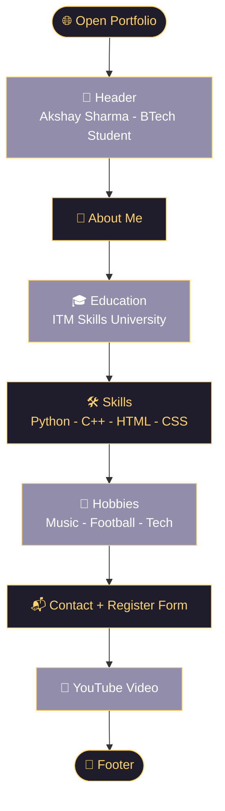

# 🧑‍💻 SWANANDI MANE| Portfolio

> *First Year BTech Student | Aspiring Web Developer*


---

## ✨ What's Inside

- 👤 About Me section
- 🎓 Education details
- 🛠️ Skills list
- 🎯 Hobbies
- 📬 Contact info + Register form
- 🎥 Embedded YouTube video
- 🌙 Glassmorphism dark UI design

---

## 📁 Folder Structure
```
📁 portfolio/
   └── 📄 index.html
```

---

## 🔄 Page Flow


---

## 🎨 Design Used

| Feature | Detail |
|---------|--------|
| Background | Dark purple gradient |
| Cards | Glassmorphism with blur effect |
| Font | Montserrat (Google Fonts) |
| Hover | Cards lift up on hover |
| Accent Color | Golden yellow `#ffd369` |

---

## 🛠️ Skills Showcased

- Python
- Basic C++
- HTML5
- CSS3

---

## ▶️ How to Run
```bash
1. Clone or download the repo
2. Open index.html in any browser
3. Portfolio is live! 🚀
```

---

> *Built with HTML & CSS only — no frameworks* 💪  
> © 2026 swanandi mane 
